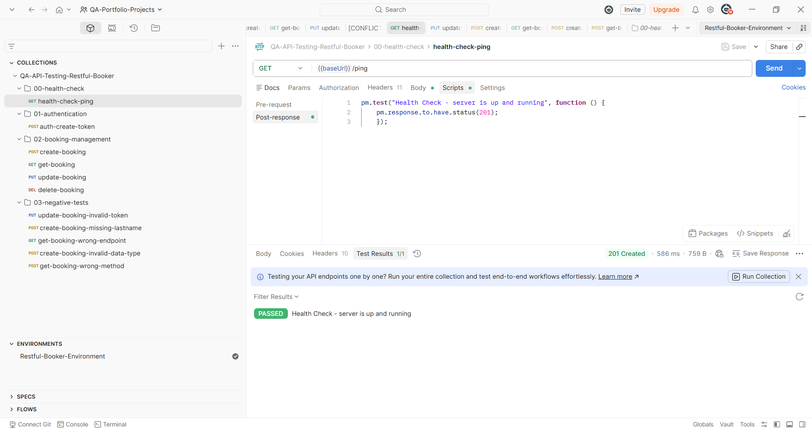
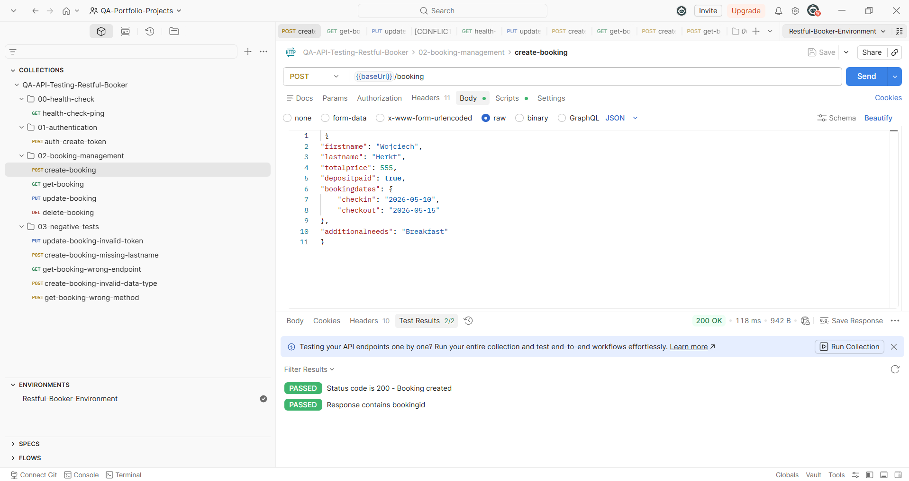
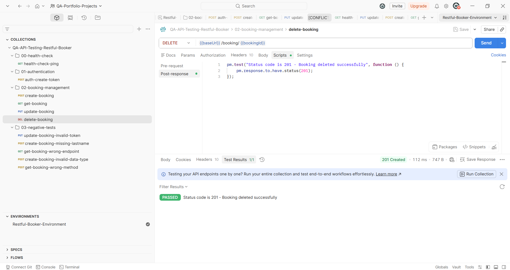
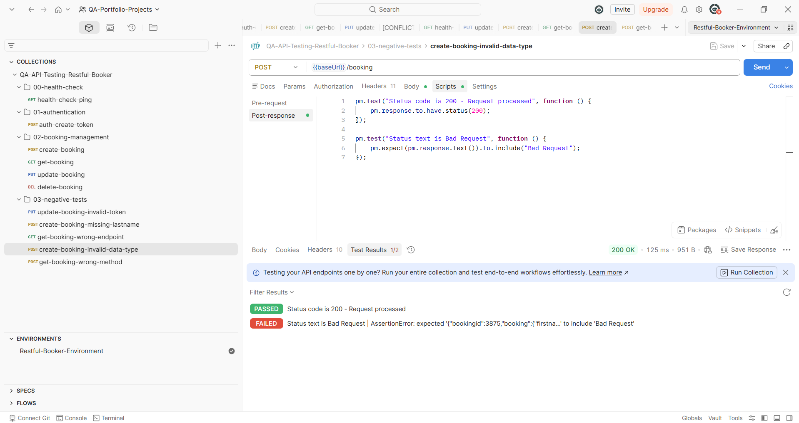
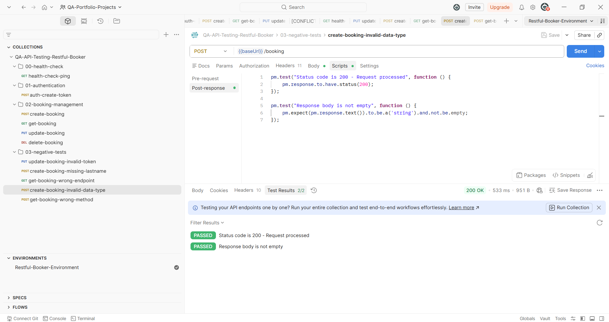
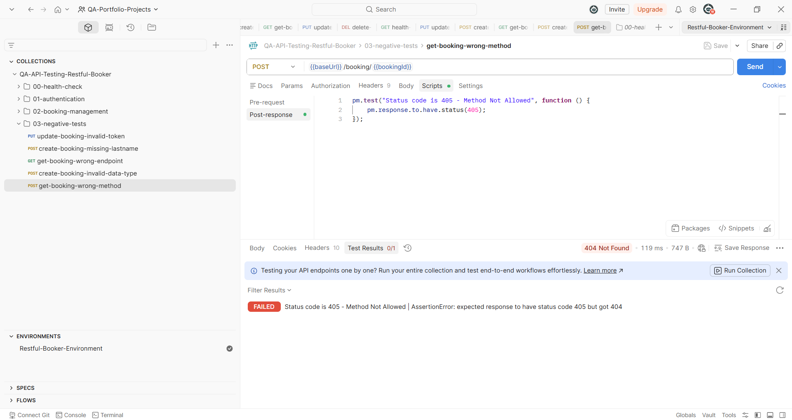
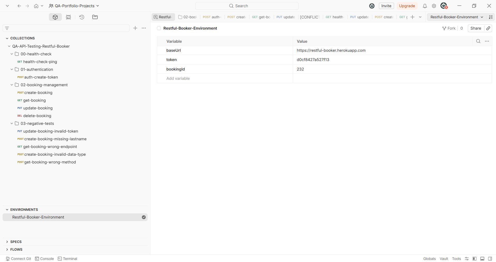

# Restful-Booker API Testing Collection (Postman)

A comprehensive API testing suite for the **Restful-Booker** hotel reservation system. This collection is structured according to domain-driven best practices, implementing a full regression testing suite, contract validation, and advanced negative (robustness) testing.

---

## Collection Structure & Test Scope

The collection is logically organized into modules that reflect the lifecycle of resources within the system:
* **`00-health-check`** - Verifies server availability and uptime.
* **`01-authentication`** - Tests the authorization module, token generation, and secure access.
* **`02-booking-management`** - Core business logic (*Happy Path*) covering the full CRUD lifecycle of a booking: creation (POST), data retrieval (GET), updates (PUT), and secure deletion (DELETE).
* **`03-negative-tests`** - Advanced robustness testing to verify how the backend handles invalid tokens, missing mandatory fields, incorrect data types, and unsupported HTTP methods.

---

## Project Showcase & Key Challenges Handled

### 1. Project Overview & Folder Structure
The collection is strictly organized into clean, isolated folders to ensure high test maintainability.

### 2. Resource Creation & Data Validation (Booking Details)
Validating proper JSON schema processing and payload consistency during new booking registrations.

### 3. Assertions & Secure Data Cleanup (Assertions)
Scripting critical assertions to ensure restricted endpoints require proper authorization headers before executing destructive actions (e.g., DELETE).

### 4. Robustness Testing: Case Study on Flaky Tests & API Anomalies
During the development of the negative test suite, major environment-specific bugs and architectural discrepancies were uncovered. Below is a detailed technical showcase of how these real-world blockers were analyzed and handled:

#### Case Study A: Flaky Strict Assertions vs Environment Noise (`create-booking-invalid-data-type`)
| ❌ The Problem: Flaky Strict Assertions | ✅ The Solution: Defensive Scripting Workaround |
| :---: | :---: |
|  |  |

##### Deep Dive into Technical Edge Cases Handled:
* **The Core Blocker (Strict Validation Flakiness):** When sending an invalid data type (e.g., a `string` instead of an `integer` inside a `POST` payload), the backend failed to return a standard JSON error schema. Instead, the deployment environment responded with a raw `text/plain` body containing `Bad Request`. Even though the visible string looked correct, a strict text validation using `pm.response.to.have.body("Bad Request")` or `pm.expect().to.include()` consistently failed due to hidden backend-delivered trailing whitespaces and carriage return control characters (`\n`, `\r`).
* **The Engineering Solution:** To immunize the automated test suite against shifting raw text structures and hidden whitespace formatting anomalies, a custom defensive scripting strategy was engineered. The validation was modified to loose string inclusion combined with type and content-existence checks (`.to.be.a('string').and.not.be.empty`). This brought the entire automation suite back to a completely reliable, robust, and reproducible green state without compromising test validity.

---

#### Case Study B: Uncovering System Contract Anomalies (`get-booking-wrong-method`)
When invoking a REST resource using an unsupported HTTP method, the architecture mandates a strict response code to maintain the API contract. However, as documented by the assertion failure below, the system's standard behavior is broken:

##### Deep Dive into Architectural Discrepancies:
* **The Discrepancy (The Red State):** As shown in the detailed Postman failure report above, sending a `POST` request to an endpoint designed exclusively for `GET` methods *should* architecturally result in a `405 Method Not Allowed` status code. Instead, the server incorrectly intercepts this routing and returns a **`404 Not Found`** response.
* **The Implementation (Documentation over False Pass):** Instead of modifying the automated test suite to assert against the faulty `404` code just to achieve a deceptive "Passed" status, I chose to maintain the correct REST standard assertion (`405`). This intentional failure serves as live documentation within the testing framework, identifying a clear legacy system bug. This approach prioritizes professional, accurate API contract documentation over forcing a false-positive test stability.

### 5. Dynamic Environment Management (Environment Variables)
Implementing test automation best practices by dynamically extracting values (e.g., auth tokens, generated booking IDs) from responses and injecting them into subsequent requests on the fly (Data Isolation).

---

## Technologies & Methodologies

* **Tools:** Postman Desktop, Collection Runner.
* **Scripting Language:** JavaScript / Chai.js Assertion Framework (Post-response / Pre-request Scripts).
* **Testing Techniques:** Boundary Value Analysis (BVA), HTTP Status Code Verification, JSON Body/Contract Validation, Dynamic Environment Variables for Data Isolation.

---

## How to Run This Project Locally

To run these  tests in your local Postman application, follow these steps:

1. **Download the Project Files:**
   * Download the collection file: `restful-booker-api-testing.postman_collection.json`
   * Download the environment file: `restful-booker-environment.postman_environment.json`

2. **Import into Postman:**
   * Open Postman and click the **Import** button.
   * Select both downloaded `.json` files to import the collection and its environment settings.

3. **Select the Environment:**
   * In the top-right corner of Postman, ensure that **`Restful-Booker-Environment`** is selected from the environment dropdown menu. This ensures the `baseUrl` and dynamic variables (`token`, `bookingId`) resolve correctly.

4. **Execute the Suite:**
   * Right-click the `QA-API-Testing-Restful-Booker` collection and select **Run collection**.
   * Click **Run** to execute the entire suite automatically via the Postman Collection Runner and view the complete test execution report.